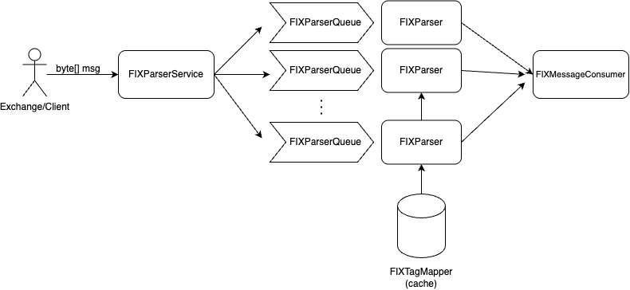
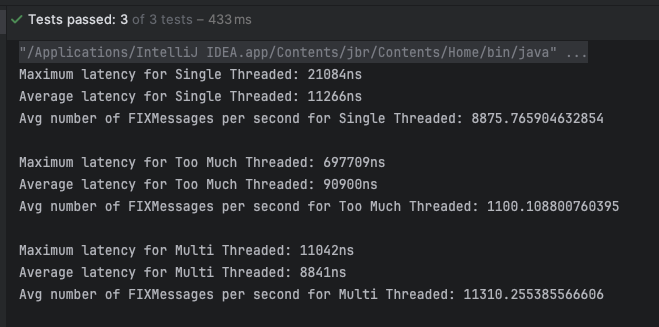
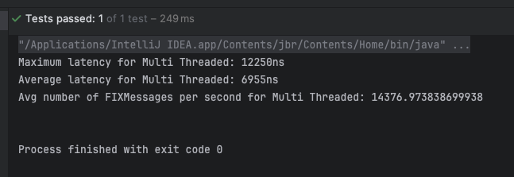
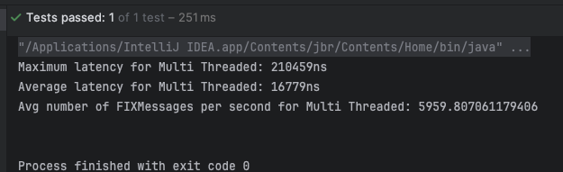
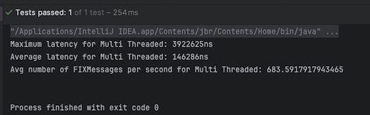

# FIX Parser 📈

Welcome to the **FIX Parser** project! This repository contains a Java application designed as a take-home assignment to parse and process FIX (Financial Information eXchange) protocol messages. The FIX protocol is widely used in the financial industry for electronic communication of trade-related messages.
To simplify the system, we assume that FIX messages will be received as byte array `byte[] msg`.

## API Usage

```java
FIXParserService service = FIXParserServiceFactory.create();
service.handleFixMessage(fixMessage);
```

- `factory` class will create FIXParserService with default configurations

## Architecture

Here is an overall architecture of FIX Parser which utilized both reusability of objects and concurrency. More details are presented below:  


### Key architecture decisions:

- Reusibility of Objects and Pre-initialization:
  - All FIX Parsers with queues and a single consumer are created during initialization phase and used throughout service lifecycle. Therefore, minimizing object creation overhead and garbage collectors cleanup overhead.
  - After each parsing, all states are reset and ready for the next process.
- Reusability vs Concurrency Trade-off:
  - As mentioned above, reusability removes object creation/removal overhead, therefore, improving the performance. However, this also means that we can't apply concurrent parsing as Reusable Objects would be shared across threads and lead to conflicts.
  - Therefore, we used Object Pooling to achieve concurrent parsing of multiple FIX messages. FIXParserService will have pre-initialized pool of FIXParser objects, where each will be handling one FIX msg concurrently.
  - _Remark_: each FIXParser is run on single thread.
- Minimize heap usage:
  - In PatternMatcher, we used first 32-bit of `long` primitive to store _offset_ and last 32-bit to store _length_. Instead of wrapping two `int` values into Object, which will be allocated to heap.
- Prioritize logical operations over functional:
  - Using `sum & 0xFF` to prevent value overflow instead of `sum % 256`.
- In-memory loading for faster lookup:
  - FIXTagMapper was loaded in-memory as `HashMap` and shared between multiple worker threads. Read-only usage of mapping lookup makes it thread-safe and decreases memory footprint.
- Parallelism over Concurrency:
  - As confirmed via Benchmark Tests, limiting number of FIX Parser workers to `CPU cores` resulted in the optimal performance. This number of threads eliminates `context switching` overhead between threads and confirms that excessive creation of threads degrades performance.

## Benchmark Testing 🚀

The project includes benchmark tests to measure the performance of the FIX parsing functionality:

- **Benchmark Test Class**: `FIXParserServiceBenchmarkTest.java`
- **Test Data**: 100 copies of the same FIX message
- **Measurements**: max latency, avg latency and throughput

### Benchmark Results

Below is a visualization of how the parser performance scales with the **number of workers**:  
Key conclusions:

- _Performance_: Optimal Thread count > Single Threaded > Too Many Threads
- This is due to excessive context switching that happens with Too Many Threads. Therefore, optimal workerCount will be in limit with number of CPU cores.



Another Benchmark Test, we tested for optimal garbage collection algorithm: G1GC, ParallelGC, ZGC.
Key conclusions:

- According to below benchmark test results, we can conclude that ZGC showed highest performance when used with optimal number of workers. Next is G1GC and last comes ParallelGC.
- **Limitations**: Although we tried to conduct benchmark with high quality (via jvm warm ups and duration tracking), this isn't enough to drive clear conclusions. Garbage collector algorithm choices are best driven after JMH (Java Microbenchmark Harness) or JFK (Java Flight Recorder). Because there we can clearly record heap usage and garbage collection activity. This also applies to our testings with multithreaded workers.

## 

## 

## 

## Further Suggestions 💡

- Better Measurement with JMH or JFK
- ByteBuffer usage
  - In real world scenario, `ByteBuffer` are more preferred than processing `byte[]`. Because FIX packages might arrive with delays, therefore, we might need to wait for other parts of FIX message to be received and later loaded to `ByteBuffer`. Therefore, providing more flexibility.
- Improve robustness
  - Update parsing algorithm to handle msg misses
- Enhance error handling and logging.

---

Feel free to reach out if you have any questions or suggestions! 😊
